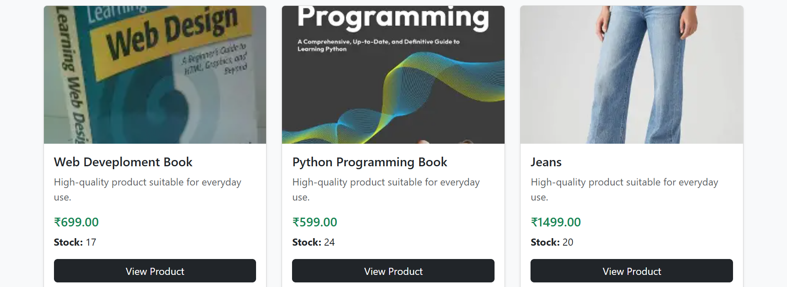
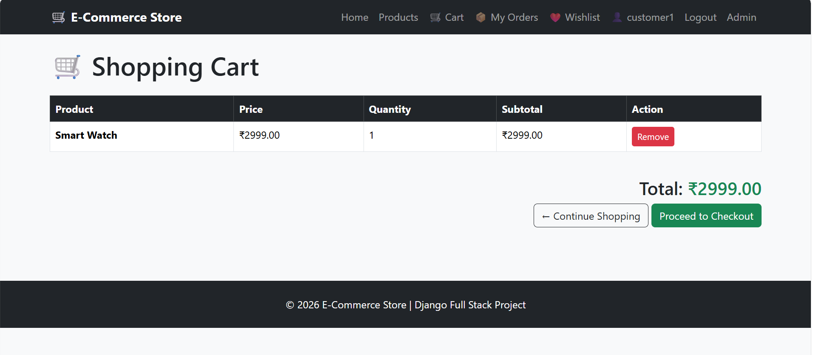
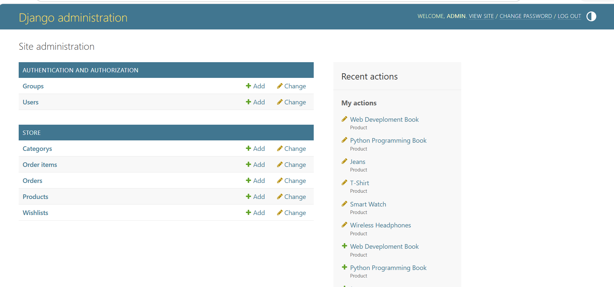
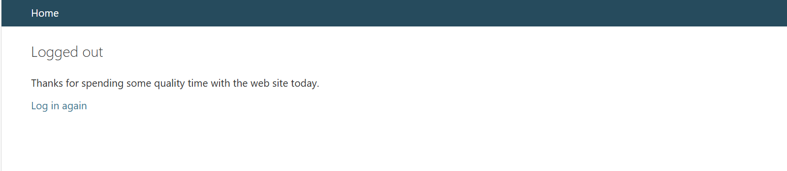

# 🛒 E-Commerce Shopping Platform

A full-stack E-Commerce Shopping Platform developed using **Python, Django, MySQL, HTML, CSS, Bootstrap, JavaScript, and Razorpay**.

This project was developed as part of the **Free Python Full Stack Internship** provided by Data Alcott Systems.

---

## 📌 Project Overview

The E-Commerce Shopping Platform is a web-based online shopping application that allows users to browse products, search and filter products, add products to their shopping cart, manage a wishlist, complete checkout, make online payments using Razorpay Test Mode, and view their order history.

The project also includes a Django Admin Panel for managing products, categories, orders, order items, wishlist records, and product stock.

---

## ✨ Features

### 👤 User Authentication

- User registration
- User login
- User logout
- Authentication-protected checkout
- User-specific order history
- User-specific wishlist

### 🛍️ Product Catalogue

- View all available products
- Product details page
- Product categories
- Product images
- Product descriptions
- Product prices
- Product stock information

### 🔍 Search & Filtering

- Search products by name
- Filter products by category
- Clear search and category filters

### 🛒 Shopping Cart

- Add products to cart
- Remove products from cart
- Quantity management
- Automatic subtotal calculation
- Automatic total calculation
- Stock availability validation

### ❤️ Wishlist

- Add products to wishlist
- View wishlist
- Remove products from wishlist
- Prevent duplicate wishlist entries

### 💳 Razorpay Payment

- Razorpay Test Mode integration
- Razorpay order creation
- Payment signature verification
- Payment capture verification
- Payment amount verification
- Server-side payment validation
- Order creation after successful payment

### 📦 Order Management

- Create orders after successful payment
- View order history
- Store delivery details
- Store payment details
- Order status management
- Automatic stock reduction after successful payment

### ⚙️ Django Admin Panel

- Manage categories
- Manage products
- Manage product stock
- Manage orders
- Manage order items
- Manage wishlist records
- Search and filter administrative data

---

## 🧰 Technologies Used

### Backend

- Python 3
- Django 5.2
- Django ORM

### Frontend

- HTML5
- CSS3
- Bootstrap 5
- JavaScript

### Database

- MySQL 8.0

### Payment Gateway

- Razorpay Test Mode

### Development Tools

- Visual Studio Code
- MySQL Workbench
- Git
- GitHub

---

## 🏗️ Application Architecture

```text
User
  │
  ▼
Frontend
HTML + CSS + Bootstrap + JavaScript
  │
  ▼
Django Application
  │
  ├── Authentication
  ├── Product Catalogue
  ├── Search & Filtering
  ├── Shopping Cart
  ├── Wishlist
  ├── Checkout
  ├── Order Management
  └── Razorpay Payment
  │
  ▼
Django ORM
  │
  ▼
MySQL Database
```

---

## 📁 Project Structure

```text
e-commerce/
│
├── ecommerce/
│   ├── __init__.py
│   ├── settings.py
│   ├── urls.py
│   ├── asgi.py
│   └── wsgi.py
│
├── store/
│   ├── migrations/
│   ├── templates/
│   │   └── store/
│   │       ├── base.html
│   │       ├── home.html
│   │       ├── product_detail.html
│   │       ├── cart.html
│   │       ├── checkout.html
│   │       ├── login.html
│   │       ├── register.html
│   │       ├── order_history.html
│   │       ├── order_success.html
│   │       └── wishlist.html
│   │
│   ├── admin.py
│   ├── apps.py
│   ├── models.py
│   ├── urls.py
│   ├── views.py
│   └── tests.py
│
├── screenshots/
│   ├── admin.png
│   ├── home.png
│   ├── logout.png
│   ├── orders.png
│   ├── payment.png
│   ├── products.png
│   └── wishlist.png
│
├── manage.py
├── .gitignore
├── README.md
└── requirements.txt
```

---

## 🗄️ Database Models

The application uses the following main Django models.

### Category

Stores product categories.

Examples:

- Electronics
- Clothing
- Books

### Product

Stores:

- Product name
- Description
- Price
- Stock
- Category
- Product image
- Creation date

### Order

Stores:

- Customer
- Full name
- Email
- Phone
- Address
- City
- State
- Pincode
- Total amount
- Order status
- Razorpay order ID
- Razorpay payment ID
- Razorpay signature
- Payment status
- Order creation date

### OrderItem

Stores:

- Order
- Product
- Quantity
- Product price

### Wishlist

Stores:

- User
- Product
- Wishlist creation date

---

## 🗃️ Sample Products

The project contains sample products in multiple categories.

### 📱 Electronics

- Wireless Headphones
- Smart Watch

### 👕 Clothing

- T-Shirt
- Jeans

### 📚 Books

- Python Programming Book
- Web Development Book

---

## 🔐 Environment Variables

Razorpay credentials are stored using environment variables.

Create a `.env` file in the project root:

```env
RAZORPAY_KEY_ID=your_razorpay_test_key_id
RAZORPAY_KEY_SECRET=your_razorpay_test_key_secret
```

**Important:** Never upload the `.env` file to GitHub.

The `.gitignore` file excludes sensitive environment variables from version control.

---

## 🗄️ MySQL Database Setup

Create the database in MySQL:

```sql
CREATE DATABASE ecommerce_db;
```

Configure the database in:

```text
ecommerce/settings.py
```

Example configuration:

```python
DATABASES = {
    'default': {
        'ENGINE': 'django.db.backends.mysql',
        'NAME': 'ecommerce_db',
        'USER': 'root',
        'PASSWORD': 'your_mysql_password',
        'HOST': 'localhost',
        'PORT': '3306',
    }
}
```

Replace `your_mysql_password` with your local MySQL password.

---

## 🚀 Installation & Setup

### 1. Clone the Repository

```bash
git clone https://github.com/Arpitha-23/e-commerce-shopping-platform.git
```

Navigate to the project:

```bash
cd e-commerce-shopping-platform
```

---

### 2. Create a Virtual Environment

```bash
python -m venv venv
```

---

### 3. Activate the Virtual Environment

For Windows PowerShell:

```powershell
venv\Scripts\Activate.ps1
```

---

### 4. Install Dependencies

```bash
pip install -r requirements.txt
```

---

### 5. Configure Environment Variables

Create a `.env` file:

```env
RAZORPAY_KEY_ID=your_razorpay_test_key_id
RAZORPAY_KEY_SECRET=your_razorpay_test_key_secret
```

---

### 6. Create MySQL Database

Open MySQL and run:

```sql
CREATE DATABASE ecommerce_db;
```

---

### 7. Run Django Migrations

```bash
python manage.py makemigrations
python manage.py migrate
```

---

### 8. Create Django Superuser

```bash
python manage.py createsuperuser
```

Enter your:

- Username
- Email
- Password

---

### 9. Run the Development Server

```bash
python manage.py runserver
```

Open the application:

```text
http://127.0.0.1:8000/
```

Django Admin:

```text
http://127.0.0.1:8000/admin/
```

---

## 💳 Razorpay Test Mode

The project uses **Razorpay Test Mode** for payment testing.

Test Mode transactions do not charge real money.

Example test card used during development:

```text
Card Number: 4386 2894 0766 0153
Expiry Date: Any future date
CVV: Any 3 digits
OTP: Test OTP
```

Use Razorpay's official documentation for the latest available test credentials and payment details.

---

## 🔒 Payment Verification Flow

The payment process works as follows:

```text
User adds products to cart
          │
          ▼
      Checkout
          │
          ▼
Create Razorpay Order
          │
          ▼
Razorpay Payment
          │
          ▼
Payment Successful
          │
          ▼
Verify Razorpay Signature
          │
          ▼
Verify Payment Status
          │
          ▼
Verify Payment Amount
          │
          ▼
Verify Product Stock
          │
          ▼
Create Order
          │
          ▼
Create Order Items
          │
          ▼
Reduce Product Stock
          │
          ▼
Clear Shopping Cart
```

---

## 🛡️ Payment Security

Before creating an order, the backend validates:

1. Razorpay order ID
2. Razorpay payment signature
3. Payment capture status
4. Payment amount
5. Cart amount
6. Product stock availability

Only after successful validation is the order stored in the database.

---

## 📸 Screenshots

### 🏠 Home Page


---

### 🛍️ Products Page



---

### 💳 Payment



---

### 📦 Order History


---

### ❤️ Wishlist


---

### ⚙️ Admin Panel



---

### 🚪 Logout



---

## 🧪 Testing

The major features of the application were tested during development.

| Feature | Status |
|---|---|
| User Registration | ✅ Working |
| User Login | ✅ Working |
| User Logout | ✅ Working |
| Product Catalogue | ✅ Working |
| Product Details | ✅ Working |
| Product Search | ✅ Working |
| Category Filtering | ✅ Working |
| Shopping Cart | ✅ Working |
| Checkout | ✅ Working |
| Razorpay Test Payment | ✅ Working |
| Payment Verification | ✅ Working |
| Order Creation | ✅ Working |
| Order History | ✅ Working |
| Wishlist | ✅ Working |
| Stock Reduction | ✅ Working |
| Django Admin | ✅ Working |

---

## 📦 Order & Inventory Management

When a payment is successfully completed:

- A new order is created.
- Order items are stored.
- Payment information is recorded.
- Payment status becomes `Paid`.
- Order status becomes `Confirmed`.
- Purchased quantity is deducted from product stock.
- The user's shopping cart is cleared.

This prevents users from purchasing quantities greater than the available stock.

---

## 👨‍💼 Django Admin Panel

The Django Admin Panel allows the administrator to manage:

```text
Categories
Products
Orders
Order Items
Wishlist
```

The administrator can also:

- Add products
- Edit products
- Update prices
- Update stock
- Manage order status
- Search orders
- Filter products
- View customer order information

---

## 🔍 Search and Category Filtering

Users can search for products using the search bar.

Example:

```text
Search: Wireless
```

Users can also filter products using categories:

```text
All Categories
Electronics
Clothing
Books
```

The search and category filters can also be used together.

---

## ❤️ Wishlist Workflow

```text
User Login
    │
    ▼
Open Product
    │
    ▼
Add to Wishlist
    │
    ▼
Wishlist Saved
    │
    ▼
View Wishlist
    │
    ▼
Remove from Wishlist
```

Each user has their own wishlist.

Duplicate wishlist entries are prevented.

---

## 🎓 Learning Outcomes

Through this project, I gained practical experience in:

- Python programming
- Django web development
- Django project structure
- Django models
- Django ORM
- MySQL database integration
- User authentication
- Session management
- CRUD operations
- Product catalogue development
- Shopping cart implementation
- Wishlist functionality
- Search and filtering
- Inventory management
- Order management
- Payment gateway integration
- Razorpay payment verification
- Django Admin customization
- Bootstrap UI development
- JavaScript integration
- Git and GitHub
- Environment variable management

---

## 🔒 Security Notes

Sensitive and unnecessary files are excluded from the GitHub repository.

The `.gitignore` includes:

```text
.env
venv/
db.sqlite3
media/
__pycache__/
.vscode/
```

Never commit:

- Razorpay secret keys
- Database passwords
- API keys
- `.env` files

---

## 📋 Internship Task Details

**Internship:** Free Python Full Stack Internship

**Company:** Data Alcott Systems

**Project:** E-Commerce Shopping Platform

**Task ID:** PY-EC-001

**Student Code:** DAS-EC-001

**Technology:** Python / Django / MySQL

**Internship Type:** Online / Self-Paced

**Duration:** 7 Days

### Task Link

https://www.freeinternships.in/python-full-stack-internship/free-python-full-stack-internship-online-ecommerce-shopping-platform-py-ec-001.php

---

## 📹 Project Demonstration

A project demonstration video will showcase:

- User registration and login
- Product browsing
- Product search
- Category filtering
- Shopping cart
- Wishlist
- Checkout
- Razorpay Test Mode payment
- Order creation
- Order history
- Django Admin Panel

YouTube Demo:

```text
Add your YouTube video link here after uploading the project demonstration.
```

---

## 🌐 Live Demo

Live deployed application:

```text
Add your deployed website link here after deployment.
```

---

## 📝 Project Report

A separate project report will contain:

- Project introduction
- Problem statement
- Objectives
- Technologies used
- System architecture
- Database design
- Features
- Implementation
- Payment integration
- Testing
- Screenshots
- Results
- Conclusion

---

## 📊 Future Enhancements

The project can be further enhanced with:

- Product quantity controls directly inside the cart
- Advanced product filtering
- Product reviews and ratings
- Coupon and discount system
- Email order confirmation
- User profile management
- Address management
- Product recommendations
- Pagination
- REST API integration
- Deployment using a cloud platform
- Improved responsive design

---

## 👩‍💻 Author

**Arpitha**

Computer Science Engineering Student

---

## 📄 License

This project was developed for educational and internship purposes.